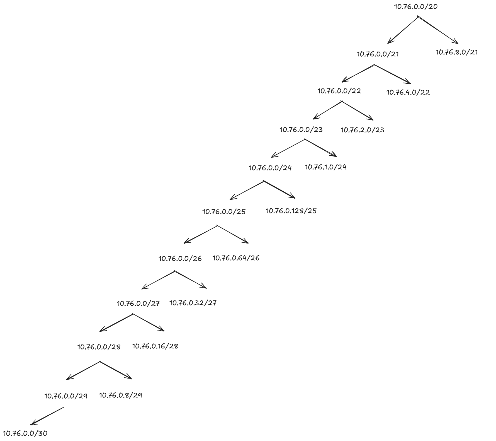
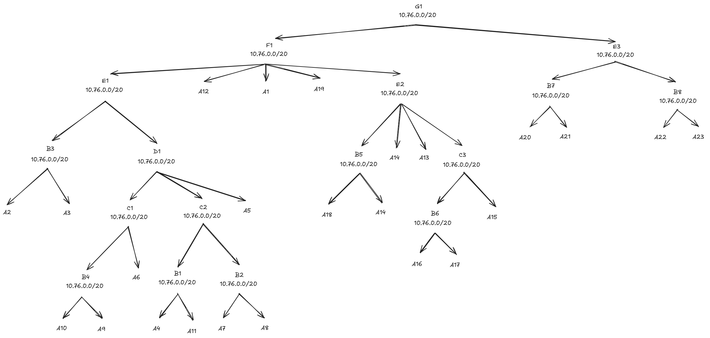

# Jarkom Modul 4 - VLSM Network Configuration
## Kelompok K25

| Nama                        | NRP        |
| --------------------------- | ---------- |
| Syifa Nurul Alfiah          | 5027241019 |
| Theodorus Aaron Ugraha      | 5027241056 |

### Topologi Jaringan
Base IP: `10.76.0.0`
Method: VLSM (Variable Length Subnet Masking)

---

# Network Configuration Guide - VLSM (GNS3) & CIDR (Cisco)

## Overview
Proyek ini berisi konfigurasi jaringan untuk implementasi VLSM di GNS3 dan CIDR di Cisco Packet Tracer, menggunakan network base `10.76.0.0/20`.

---

## VLSM Configuration (GNS3 - Ubuntu)

### Struktur Subnet VLSM
Berdasarkan file `VLSM.csv`, subnet dialokasikan secara efisien berdasarkan kebutuhan host.

### Router Configuration Pattern

#### 1. **Amansul** (Router Pusat)
```bash
# Interfaces:
# eth0: to Eregion (A1: 10.76.15.193/30)
# eth1: to Minastir (A12: 10.76.15.213/30)
# eth2: to Fornost (A19: 10.76.15.229/30)
```

#### 2. **Eregion**
```bash
# Interfaces:
# eth0: to Amansul (A1: 10.76.15.194/30)
# eth1: to Numenor (A3: 10.76.15.197/30)
```

#### 3. **Numenor**
```bash
# Interfaces:
# eth0: to Eregion (A3: 10.76.15.198/30)
# eth1: to Gudur (A4: 10.76.15.201/30)
# eth2: to Mordor (A5: 10.76.15.205/30)
```

#### 4. **Minastir**
```bash
# Interfaces:
# eth0: to Amansul (A12: 10.76.15.214/30)
# eth1: to Anor (A14: 10.76.15.221/30)
# eth2: to Amroth (A13: 10.76.15.217/30)
```

#### 5. **Fornost**
```bash
# Interfaces:
# eth0: to Amansul (A19: 10.76.15.230/30)
# eth1: to Switch13/Valinor (A20: 10.76.15.185/29)
# eth2: to Switch5/Arthendain (A10: 10.76.8.1/23)
```

### Client Configuration Pattern
```bash
#!/bin/bash
# Client Configuration Example

# Set IP address
ip addr add <IP_ADDRESS>/<NETMASK> dev eth0
ip link set eth0 up

# Set default gateway
ip route add default via <GATEWAY_IP> dev eth0

# Set DNS (optional)
echo "nameserver 8.8.8.8" > /etc/resolv.conf
```

### Tampilan tabel VLSM



### VLSM Subnet Allocation Table

| Subnet | Network | Netmask | Range | Usage |
|--------|---------|---------|-------|-------|
| A11 | 10.76.0.0 | /22 | 10.76.0.1 - 10.76.3.254 | Mirdain+Arthedain (874 host) |
| A18 | 10.76.4.0 | /22 | 10.76.4.1 - 10.76.7.254 | Beacon+Silmarils (660 host) |
| A10 | 10.76.8.0 | /23 | 10.76.8.1 - 10.76.9.254 | Melkor+Khazad (502 host) |
| A9 | 10.76.10.0 | /23 | 10.76.10.1 - 10.76.11.254 | Balrog+Gothmog+Thranduil (469 host) |
| A21 | 10.76.12.0 | /23 | 10.76.12.1 - 10.76.13.254 | Shadow+Anarion+Lindon (298 host) |
| A2 | 10.76.14.0 | /25 | 10.76.14.1 - 10.76.14.126 | Mirkwood+Morgul (125 host) |
| A8 | 10.76.14.128 | /25 | 10.76.14.129 - 10.76.14.254 | Palantir+Edhil (119 host) |
| A16 | 10.76.15.0 | /26 | 10.76.15.1 - 10.76.15.62 | Erendis+Elrond (61 host) |
| A23 | 10.76.15.64 | /26 | 10.76.15.65 - 10.76.15.126 | Imrahil+Gwaith+Utumno (33 host) |
| A22 | 10.76.15.128 | /27 | 10.76.15.129 - 10.76.15.158 | Doriath+Arnor (27 host) |
| A7 | 10.76.15.160 | /28 | 10.76.15.161 - 10.76.15.174 | IronCrown+Grond+Hobbiton (13 host) |
| A15 | 10.76.15.176 | /29 | 10.76.15.177 - 10.76.15.182 | Morgoth+Throne (3 host) |
| A20 | 10.76.15.184 | /29 | 10.76.15.185 - 10.76.15.190 | Valinor+Valmar (3 host) |
| A1 | 10.76.15.192 | /30 | 10.76.15.193 - 10.76.15.194 | Amansul-Eregion (P2P) |
| A3 | 10.76.15.196 | /30 | 10.76.15.197 - 10.76.15.198 | Eregion-Numenor (P2P) |
| A4 | 10.76.15.200 | /30 | 10.76.15.201 - 10.76.15.202 | Numenor-Gudur (P2P) |
| A5 | 10.76.15.204 | /30 | 10.76.15.205 - 10.76.15.206 | Numenor-Mordor (P2P) |
| A6 | 10.76.15.208 | /30 | 10.76.15.209 - 10.76.15.210 | Mordor-Erain (P2P) |
| A12 | 10.76.15.212 | /30 | 10.76.15.213 - 10.76.15.214 | Amansul-Minastir (P2P) |
| A13 | 10.76.15.216 | /30 | 10.76.15.217 - 10.76.15.218 | Minastir-Amroth (P2P) |
| A14 | 10.76.15.220 | /30 | 10.76.15.221 - 10.76.15.222 | Minastir-Anor (P2P) |
| A17 | 10.76.15.224 | /30 | 10.76.15.225 - 10.76.15.226 | Throne-Erebor (P2P) |
| A19 | 10.76.15.228 | /30 | 10.76.15.229 - 10.76.15.230 | Amansul-Fornost (P2P) |

---

## CIDR Configuration (Cisco Packet Tracer)

### Struktur Subnet CIDR
Berdasarkan file `CIDR.csv`, subnet diagregasi secara hierarkis menggunakan metode bottom-up untuk route summarization.

### Router Configuration Pattern

#### 1. **Amansul** (Router Pusat)
```cisco
! Interfaces:
! FastEthernet0/0: to Eregion (10.76.15.193/30)
! FastEthernet0/1: to Minastir (10.76.15.213/30)
! FastEthernet1/0: to Fornost (10.76.15.229/30)

! Static Routes (Aggregated):
ip route 10.76.0.0 255.255.240.0 10.76.15.194    ! To Eregion side
ip route 10.76.4.0 255.255.252.0 10.76.15.214    ! To Minastir side
ip route 10.76.12.0 255.255.254.0 10.76.15.214   ! To Minastir side
ip route 10.76.8.0 255.255.252.0 10.76.15.230    ! To Fornost side
```

#### 2. **Eregion**
```cisco
! Interfaces:
! FastEthernet0/0: to Amansul (10.76.15.194/30)
! FastEthernet0/1: to Numenor (10.76.15.225/30)
! FastEthernet1/0: to Switch8/Mirkwood (10.76.0.1/25)

! Static Routes:
ip route 0.0.0.0 0.0.0.0 10.76.15.193               ! Default to Amansul
ip route 10.76.14.0 255.255.255.0 10.76.15.226      ! To Numenor side
ip route 10.76.15.0 255.255.255.128 10.76.15.226    ! To Numenor side
```

#### 3. **Numenor**
```cisco
! Interfaces:
! FastEthernet0/0: to Eregion (10.76.15.226/30)
! FastEthernet0/1: to Gudur (10.76.15.177/29)
! FastEthernet1/0: to Switch7/Palantir (10.76.15.65/26)

! Static Routes:
ip route 0.0.0.0 0.0.0.0 10.76.15.225               ! Default to Eregion
ip route 10.76.14.0 255.255.255.0 10.76.15.178      ! To Gudur side
ip route 10.76.15.0 255.255.255.192 10.76.15.178    ! To Gudur side
```

#### 4. **Gudur**
```cisco
! Interfaces:
! FastEthernet0/0: to Numenor (10.76.15.178/29)
! FastEthernet0/1: to Switch6/IronCrown (10.76.15.1/26)
! FastEthernet1/0: to Mordor (10.76.15.129/26)
! FastEthernet1/1: to Switch5 (IronCrown, Grond, Hobbiton)

! Static Routes:
ip route 0.0.0.0 0.0.0.0 10.76.15.177               ! Default to Numenor
ip route 10.76.14.0 255.255.255.0 10.76.15.130      ! To Mordor side
```

#### 5. **Mordor**
```cisco
! Interfaces:
! FastEthernet0/0: to Gudur (10.76.15.130/26)
! FastEthernet0/1: to Erain (10.76.14.1/24)

! Static Routes:
ip route 0.0.0.0 0.0.0.0 10.76.15.129               ! Default to Gudur
```

#### 6. **Erain**
```cisco
! Interfaces:
! FastEthernet0/0: to Mordor (10.76.14.2/24)

! Static Routes:
ip route 0.0.0.0 0.0.0.0 10.76.14.1                 ! Default to Mordor
```


#### 8. **Minastir**
```cisco
! Interfaces:
! FastEthernet0/0: to Amansul (10.76.15.214/30)
! FastEthernet0/1: to Amroth (10.76.15.209/30)
! FastEthernet1/0: to Anor (10.76.15.205/30)
! FastEthernet1/1: to Erebor (10.76.5.1/24)

! Static Routes:
ip route 0.0.0.0 0.0.0.0 10.76.15.213               ! Default to Amansul
ip route 10.76.4.0 255.255.252.0 10.76.15.210       ! To Amroth side
```

#### 9. **Amroth**
```cisco
! Interfaces:
! FastEthernet0/0: to Minastir (10.76.15.210/30)
! FastEthernet0/1: to Morgoth (10.76.15.201/30)
! FastEthernet1/0: to Switch2/Erendis (10.76.7.1/26)

! Static Routes:
ip route 0.0.0.0 0.0.0.0 10.76.15.209               ! Default to Minastir
ip route 10.76.4.0 255.255.254.0 10.76.15.202       ! To Morgoth side
```

#### 10. **Morgoth**
```cisco
! Interfaces:
! FastEthernet0/0: to Amroth (10.76.15.202/30)
! FastEthernet0/1: to Switch3/Balrog (10.76.4.1/23)

! Static Routes:
ip route 0.0.0.0 0.0.0.0 10.76.15.201               ! Default to Amroth
```

#### 11. **Anor**
```cisco
! Interfaces:
! FastEthernet0/0: to Minastir (10.76.15.206/30)
! FastEthernet0/1: to Switch4/Melkor (10.76.6.1/23)

! Static Routes:
ip route 0.0.0.0 0.0.0.0 10.76.15.205               ! Default to Minastir
```

#### 12. **Fornost**
```cisco
! Interfaces:
! FastEthernet0/0: to Amansul (10.76.15.230/30)
! FastEthernet0/1: to Switch5/Arthendain (10.76.8.1/23)
! FastEthernet1/0: to Valinor (10.76.10.1/23)

! Static Routes:
ip route 0.0.0.0 0.0.0.0 10.76.15.229               ! Default to Amansul
ip route 10.76.12.0 255.255.254.0 10.76.10.2        ! To Valinor side
```

#### 13. **Valinor**
```cisco
! Interfaces:
! FastEthernet0/0: to Fornost (10.76.10.2/23)
! FastEthernet0/1: to Valmar (10.76.12.1/23)

! Static Routes:
ip route 0.0.0.0 0.0.0.0 10.76.10.1                 ! Default to Fornost
```

#### 14. **Valmar**
```cisco
! Interfaces:
! FastEthernet0/0: to Valinor (10.76.12.2/23)
! FastEthernet0/1: to Switch11/Anarion (10.76.13.1/24)

! Static Routes:
ip route 0.0.0.0 0.0.0.0 10.76.12.1                 ! Default to Valinor
```

### Client Configuration Pattern (Ubuntu)
```bash
#!/bin/bash
# Client Configuration Example

# Configure network interface
auto eth0
iface eth0 inet static
    address [IP_ADDRESS]
    netmask [NETMASK]
    gateway [GATEWAY]

# Apply configuration
ifconfig eth0 [IP_ADDRESS] netmask [NETMASK]
route add default gw [GATEWAY]

# Set DNS (optional)
echo "nameserver 192.168.122.1" > /etc/resolv.conf
```

### Tampilan tabel CIDR



### CIDR Subnet Aggregation Table

#### Level I - Base Subnets (B-Level)
| Subnet | Network | Netmask | Range | Usage |
|--------|---------|---------|-------|-------|
| B1 | 10.76.0.0 | /22 | 10.76.0.1 - 10.76.3.254 | Aggregasi A1 (Beacon+Silmarils) |
| B2 | 10.76.5.0 | /24 | 10.76.5.1 - 10.76.5.254 | Aggregasi A2 (Erebor) |
| B3 | 10.76.14.0 | /24 | 10.76.14.1 - 10.76.14.254 | Aggregasi A14 (Mordor-Erain) |
| B4 | 10.76.8.0 | /22 | 10.76.8.1 - 10.76.11.254 | Aggregasi A10 (Arthendain+Lindon) |
| B5 | 10.76.4.0 | /22 | 10.76.4.1 - 10.76.7.254 | Aggregasi A3, A8, A9 |
| B6 | 10.76.15.0 | /25 | 10.76.15.1 - 10.76.15.126 | Aggregasi A11, A12, A19, A20 |
| B7 | 10.76.12.0 | /23 | 10.76.12.1 - 10.76.13.254 | Aggregasi A21 (Anarion) |
| B8 | 10.76.15.128 | /26 | 10.76.15.129 - 10.76.15.190 | Aggregasi P2P links |

#### Level II - Second Aggregation (C-Level)
| Subnet | Network | Netmask | Merged From |
|--------|---------|---------|-------------|
| C1 | 10.76.8.0 | /22 | B4 |
| C2 | 10.76.0.0 | /22 | B1 |
| C3 | 10.76.15.0 | /25 | B6 |

#### Level III - Higher Aggregation (D, E, F, G-Level)
| Subnet | Network | Netmask | Merged From |
|--------|---------|---------|-------------|
| D1 | 10.76.0.0 | /21 | C2, B5, B2 |
| E1 | 10.76.0.0 | /20 | Final aggregation |
| E2 | 10.76.4.0 | /22 | B5 |
| E3 | 10.76.12.0 | /23 | B7 |
| F1 | 10.76.0.0 | /20 | E1 |
| G1 | 10.76.0.0 | /20 | F1 (Root) |

### Client IP Assignments

#### Area Amansul-Eregion
- **Beacon**: 10.76.0.2/22 → Gateway: 10.76.0.1
- **Silmarils**: 10.76.0.3/22 → Gateway: 10.76.0.1
- **Mirkwood**: 10.76.0.2/25 → Gateway: 10.76.0.1 (Eregion)
- **Mirdain**: 10.76.0.3/25 → Gateway: 10.76.0.1 (Eregion)
- **Edhil**: 10.76.0.4/25 → Gateway: 10.76.0.1 (Eregion)
- **Gwaith**: 10.76.0.5/25 → Gateway: 10.76.0.1 (Eregion)
- **Elrond**: 10.76.0.6/25 → Gateway: 10.76.0.1 (Eregion)

#### Area Numenor-Gudur
- **Palantir**: 10.76.15.66/26 → Gateway: 10.76.15.65 (Numenor)
- **Khazad**: 10.76.15.67/26 → Gateway: 10.76.15.65 (Numenor)
- **Thranduil**: 10.76.15.68/26 → Gateway: 10.76.15.65 (Numenor)
- **IronCrown**: 10.76.15.2/26 → Gateway: 10.76.15.1 (Gudur)
- **Shadow**: 10.76.15.3/26 → Gateway: 10.76.15.1 (Gudur)

#### Area Gudur
- **IronCrown**: 10.76.15.161/28 → Gateway: 10.76.15.160 (Gudur)
- **Grond**: 10.76.15.162/28 → Gateway: 10.76.15.160 (Gudur)
- **Hobbiton**: 10.76.15.163/28 → Gateway: 10.76.15.160 (Gudur)
- **Palantir**: 10.76.14.129/25 → Gateway: 10.76.14.128 (Gudur)
- **Edhil**: 10.76.14.130/25 → Gateway: 10.76.14.128 (Gudur)

#### Area Valmar
- **Imrahil**: 10.76.15.66/26 → Gateway: 10.76.15.65 (Valmar)
- **Gwaith**: 10.76.15.67/26 → Gateway: 10.76.15.65 (Valmar)
- **Utumno**: 10.76.15.68/26 → Gateway: 10.76.15.65 (Valmar)
- **Doriath**: 10.76.15.129/27 → Gateway: 10.76.15.128 (Valmar)
- **Arnor**: 10.76.15.130/27 → Gateway: 10.76.15.128 (Valmar)

#### Area Minastir-Amroth-Morgoth
- **Erebor**: 10.76.5.2/24 → Gateway: 10.76.5.1 (Minastir)
- **Erendis**: 10.76.7.2/26 → Gateway: 10.76.7.1 (Amroth)
- **Balrog**: 10.76.4.2/23 → Gateway: 10.76.4.1 (Morgoth)
- **Grond**: 10.76.4.3/23 → Gateway: 10.76.4.1 (Morgoth)

#### Area Anor
- **Melkor**: 10.76.6.2/23 → Gateway: 10.76.6.1
- **Utumno**: 10.76.6.3/23 → Gateway: 10.76.6.1

#### Area Fornost-Valinor-Valmar
- **Arthendain**: 10.76.8.2/23 → Gateway: 10.76.8.1 (Fornost)
- **Lindon**: 10.76.8.3/23 → Gateway: 10.76.8.1 (Fornost)
- **Anarion**: 10.76.13.2/24 → Gateway: 10.76.13.1 (Valmar)
- **Arnor**: 10.76.13.3/24 → Gateway: 10.76.13.1 (Valmar)

---

## Implementation Steps

### For VLSM (GNS3):

1. **Setup Topology** di GNS3 sesuai dengan gambar topologi
2. **Copy Configuration Files** ke setiap node:
   ```bash
   # Di setiap router
   sudo bash /path/to/<router_name>.sh
   ```
3. **Test Connectivity**:
   ```bash
   ping <destination_ip>
   traceroute <destination_ip>
   ```

### For CIDR (Cisco Packet Tracer):

1. **Setup Topology** di Cisco Packet Tracer
2. **Configure Interfaces** menggunakan GUI atau CLI
3. **Add Static Routes** dengan agregasi CIDR
4. **Test Connectivity** menggunakan ping dan tracert

---

## Routing Strategy

### VLSM (Specific Routes):
- Menggunakan routing spesifik untuk setiap subnet
- Routing table lebih besar tetapi lebih presisi
- Cocok untuk troubleshooting detail

### CIDR (Aggregated Routes):
- Menggunakan route summarization
- Routing table lebih kecil dan efisien
- Cocok untuk jaringan besar dengan hierarki jelas

---

## Testing Commands

```bash
# Check interface status
ip addr show

# Check routing table
ip route show

# Test connectivity
ping -c 4 <destination_ip>

# Trace route
traceroute <destination_ip>

# Check IP forwarding
cat /proc/sys/net/ipv4/ip_forward

# Enable IP forwarding (if not enabled)
echo 1 > /proc/sys/net/ipv4/ip_forward
```

---

## Troubleshooting

### Common Issues:

1. **No connectivity between subnets**
   - Check IP forwarding is enabled
   - Verify routing table
   - Check interface status

2. **Partial connectivity**
   - Verify static routes are correct
   - Check next-hop addresses
   - Ensure no IP conflicts

3. **Gateway unreachable**
   - Verify gateway IP in client configuration
   - Check router interface is up
   - Verify subnet mask is correct

---

## Notes

- **VLSM** lebih kompleks tetapi lebih efisien dalam penggunaan IP
- **CIDR** lebih sederhana dalam routing tetapi memerlukan planning awal yang baik
- Kedua metode menggunakan network base yang sama (10.76.0.0/20) tetapi dengan alokasi berbeda
- Untuk production, disarankan menggunakan dynamic routing (OSPF/BGP) dibanding static routing

---